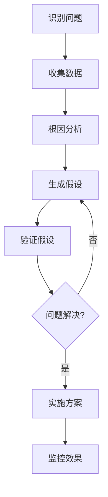

# Catlink Growth System - Claude AI 交互规则

## 1. 语言规则
- **交流语言**：使用中文与用户进行所有对话和交流
- **代码语言**：所有代码生成全部使用英文，包括注释、变量名、函数名等

## 2. 交互原则
- **批判性思维**：每次都用审视的目光，仔细分析用户输入的潜在问题
- **主动建议**：指出用户可能存在的问题，并给出超出用户思考框架之外的创新建议
- **建设性反馈**：以专业和尊重的方式直接指出不合理之处，并提供具体改进方案

## 3. 视频预览功能实现规范（优化版）

### 3.1 技术架构
```javascript
// 推荐的视频预览组件架构
VideoPreviewCard
├── VideoThumbnail (默认显示)
├── VideoPlayer (按需加载)
├── PlatformAdapter (平台适配器)
└── LoadingState (加载状态)
```

### 3.2 平台适配策略

#### YouTube
- **可嵌入**：使用YouTube IFrame API
- **横屏视频**：16:9 标准容器
- **Shorts**：9:16 竖屏容器
```javascript
// YouTube嵌入示例
<iframe src="https://www.youtube.com/embed/VIDEO_ID" />
```

#### TikTok
- **限制**：不支持直接嵌入播放
- **解决方案**：
  1. 显示视频封面 + TikTok logo
  2. 点击跳转到TikTok网站
  3. 或使用TikTok Embed API（仅显示，不可播放）

#### Instagram
- **限制**：严格的嵌入限制
- **解决方案**：
  1. 使用Instagram oEmbed API获取预览
  2. 显示静态预览 + 播放按钮
  3. 点击在模态框中打开

### 3.3 视频容器标准尺寸

```css
/* 横屏视频容器 (16:9) */
.video-container-landscape {
  aspect-ratio: 16/9;
  max-width: 100%;
  height: auto;
}

/* 竖屏视频容器 (9:16) */
.video-container-portrait {
  aspect-ratio: 9/16;
  max-height: 500px;
  width: auto;
}

/* 响应式网格布局 */
.video-grid {
  display: grid;
  grid-template-columns: repeat(auto-fit, minmax(300px, 1fr));
  gap: 16px;
}
```

### 3.4 性能优化策略

#### 1. 虚拟滚动实现
```javascript
// 使用 react-window 或 react-virtualized
import { FixedSizeList } from 'react-window';

<FixedSizeList
  height={600}
  itemCount={videos.length}
  itemSize={300}
  width="100%"
>
  {({ index, style }) => (
    <VideoCard video={videos[index]} style={style} />
  )}
</FixedSizeList>
```

#### 2. Intersection Observer 懒加载
```javascript
// 视频懒加载 Hook
const useVideoLazyLoad = (threshold = 0.1) => {
  const [isInView, setIsInView] = useState(false);
  const ref = useRef(null);

  useEffect(() => {
    const observer = new IntersectionObserver(
      ([entry]) => setIsInView(entry.isIntersecting),
      { threshold }
    );
    if (ref.current) observer.observe(ref.current);
    return () => observer.disconnect();
  }, [threshold]);

  return [ref, isInView];
};
```

#### 3. 预加载策略
- 首屏视频：立即加载缩略图
- 第二屏视频：延迟1秒加载
- 其余视频：滚动到可视区域时加载

### 3.5 错误处理和降级方案

1. **视频加载失败**
   - 显示默认占位图
   - 提供重试按钮
   - 记录错误日志

2. **平台API限制**
   - 实现请求限流
   - 缓存视频元数据
   - 提供离线预览模式

3. **跨域问题处理**
   - 使用代理服务器
   - 实现CORS友好的API网关
   - 备用CDN方案

### 3.6 用户体验优化

1. **加载状态**
   - 骨架屏显示
   - 进度条指示
   - 平滑过渡动画

2. **交互反馈**
   - 悬停显示播放按钮
   - 点击后立即响应
   - 加载中显示spinner

3. **适配多设备**
   - 移动端：点击全屏播放
   - 平板：自适应布局
   - 桌面：悬浮预览

### 3.7 实现优先级

1. **Phase 1**：YouTube嵌入播放（最简单）
2. **Phase 2**：视频缩略图 + 模态播放器
3. **Phase 3**：虚拟滚动 + 懒加载
4. **Phase 4**：多平台适配 + 高级功能

## 4. 项目特定规则（2025最新技术栈）

### 4.1 技术栈升级建议
#### 当前技术栈
- **前端**：React 18 + Redux Toolkit + Ant Design
- **后端**：Node.js + Express + Sequelize ORM
- **数据库**：SQLite (开发) / PostgreSQL (生产)

#### 推荐升级方向
- **前端框架**：
  - 考虑 Next.js 14+ (App Router) 实现 SSR/SSG
  - 或 Vite + React 获得更快的开发体验
  - TypeScript 5.x 强类型支持
- **状态管理**：
  - Zustand (轻量级) 或 Jotai (原子化状态)
  - TanStack Query v5 处理服务端状态
- **样式方案**：
  - Tailwind CSS v3.4 + shadcn/ui
  - CSS-in-JS: Emotion 或 styled-components
- **后端升级**：
  - Fastify (更高性能) 或继续 Express
  - Prisma ORM (类型安全) 替代 Sequelize
  - tRPC 实现端到端类型安全
- **数据库**：
  - PostgreSQL + Redis (缓存)
  - 考虑 Supabase 或 PlanetScale

### 4.2 现代开发实践

#### 代码质量工具链
```json
{
  "linting": "ESLint 8.x + Prettier 3.x",
  "typeChecking": "TypeScript 5.x strict mode",
  "preCommit": "husky + lint-staged",
  "testing": {
    "unit": "Vitest + React Testing Library",
    "e2e": "Playwright",
    "visual": "Chromatic + Storybook"
  },
  "bundling": "Vite 5.x 或 Turbopack"
}
```

#### Git 工作流
- **Conventional Commits**: `feat:`, `fix:`, `docs:`, `chore:`
- **分支策略**: Git Flow 或 GitHub Flow
- **PR模板**: 包含checklist和测试要求
- **自动化**: GitHub Actions CI/CD

### 4.3 性能优化 2025

#### Core Web Vitals 目标
- **LCP** (Largest Contentful Paint): < 2.5s
- **FID** (First Input Delay): < 100ms  
- **CLS** (Cumulative Layout Shift): < 0.1
- **INP** (Interaction to Next Paint): < 200ms

#### 优化策略
```javascript
// 1. React Server Components (RSC)
// app/dashboard/page.tsx
export default async function DashboardPage() {
  const data = await fetchData(); // 服务端获取
  return <Dashboard data={data} />;
}

// 2. Suspense + 流式渲染
<Suspense fallback={<DashboardSkeleton />}>
  <Dashboard />
</Suspense>

// 3. 图片优化
import Image from 'next/image';
<Image 
  src="/catlink-product.webp" 
  alt="Product" 
  loading="lazy"
  placeholder="blur"
/>

// 4. 路由预加载
import { prefetch } from '@tanstack/react-router';
prefetch('/dashboard');
```

### 4.4 安全最佳实践 2025

#### 认证与授权
- **OAuth 2.0 + OIDC**: 使用 Auth.js (NextAuth v5)
- **JWT**: 短期 access token + refresh token
- **Session管理**: iron-session 或 lucia-auth
- **权限控制**: CASL 或 Permit.io

#### 安全清单
```typescript
// 1. 输入验证 (使用 Zod)
import { z } from 'zod';
const schema = z.object({
  email: z.string().email(),
  password: z.string().min(8).regex(/[A-Z]/).regex(/[0-9]/)
});

// 2. Rate Limiting
import { Ratelimit } from '@upstash/ratelimit';
const ratelimit = new Ratelimit({
  redis: Redis,
  limiter: Ratelimit.slidingWindow(10, '10 s'),
});

// 3. CORS 配置
const corsOptions = {
  origin: process.env.ALLOWED_ORIGINS?.split(','),
  credentials: true,
  optionsSuccessStatus: 200
};

// 4. 安全响应头
const securityHeaders = {
  'X-DNS-Prefetch-Control': 'on',
  'Strict-Transport-Security': 'max-age=63072000',
  'X-Frame-Options': 'SAMEORIGIN',
  'X-Content-Type-Options': 'nosniff',
  'Referrer-Policy': 'origin-when-cross-origin',
  'Permissions-Policy': 'camera=(), microphone=(), geolocation=()'
};
```

### 4.5 AI 集成最佳实践

#### LLM 集成
```typescript
// 1. Vercel AI SDK
import { openai } from '@ai-sdk/openai';
import { streamText } from 'ai';

export async function POST(req: Request) {
  const { messages } = await req.json();
  
  const result = await streamText({
    model: openai('gpt-4-turbo'),
    messages,
    temperature: 0.7,
  });
  
  return result.toAIStreamResponse();
}

// 2. 向量数据库集成
import { Pinecone } from '@pinecone-database/pinecone';
const pinecone = new Pinecone();

// 3. RAG (Retrieval-Augmented Generation)
import { ChatOpenAI } from '@langchain/openai';
import { MemoryVectorStore } from 'langchain/vectorstores/memory';
```

### 4.6 监控与可观测性

#### 工具链
- **APM**: Sentry 或 Datadog
- **日志**: Winston + Logtail
- **分析**: PostHog 或 Plausible
- **性能**: SpeedCurve 或 Calibre

#### 实现示例
```typescript
// 1. 错误追踪
import * as Sentry from '@sentry/nextjs';
Sentry.init({
  dsn: process.env.SENTRY_DSN,
  tracesSampleRate: 0.1,
  profilesSampleRate: 0.1,
});

// 2. 自定义指标
import { metrics } from '@opentelemetry/api';
const meter = metrics.getMeter('catlink-app');
const counter = meter.createCounter('api_requests');
counter.add(1, { endpoint: '/api/products' });
```

### 4.7 部署与基础设施

#### 推荐架构
- **托管**: Vercel (前端) + Railway/Render (后端)
- **容器化**: Docker + Kubernetes (可选)
- **CDN**: Cloudflare 或 Fastly
- **CI/CD**: GitHub Actions + Vercel/Netlify

#### Infrastructure as Code
```yaml
# docker-compose.yml
version: '3.8'
services:
  web:
    build: .
    ports:
      - "3000:3000"
    environment:
      - DATABASE_URL=postgresql://...
    depends_on:
      - db
      - redis
  
  db:
    image: postgres:16-alpine
    volumes:
      - postgres_data:/var/lib/postgresql/data
  
  redis:
    image: redis:7-alpine
```

## 5. 开发流程建议（敏捷实践）

### 5.1 需求分析 (DDD思维)
```typescript
// 1. 领域建模示例
interface Product {
  id: string;
  name: string;
  category: 'litter-box' | 'steamer';
  price: Money;
  features: Feature[];
}

// 2. 用例驱动
class AnalyzeProductContent {
  constructor(
    private contentRepo: ContentRepository,
    private aiService: AIAnalysisService
  ) {}
  
  async execute(productId: string): Promise<AnalysisResult> {
    // 业务逻辑
  }
}
```

### 5.2 测试驱动开发 (TDD)
```typescript
// 1. 先写测试
describe('ProductAnalysis', () => {
  it('should identify competitive advantages', async () => {
    const analysis = await analyzeProduct(mockCatlinkData);
    expect(analysis.advantages).toContain('best-value');
  });
});

// 2. 实现功能
// 3. 重构优化
```

### 5.3 持续集成/部署 (CI/CD)

#### GitHub Actions 配置
```yaml
name: CI/CD Pipeline
on:
  push:
    branches: [main, develop]
  pull_request:
    branches: [main]

jobs:
  test:
    runs-on: ubuntu-latest
    steps:
      - uses: actions/checkout@v4
      - uses: actions/setup-node@v4
        with:
          node-version: '20'
          cache: 'npm'
      
      - run: npm ci
      - run: npm run lint
      - run: npm run type-check
      - run: npm run test:unit
      - run: npm run test:e2e
      
      - name: SonarCloud Scan
        uses: SonarSource/sonarcloud-github-action@master
        
  deploy:
    needs: test
    if: github.ref == 'refs/heads/main'
    runs-on: ubuntu-latest
    steps:
      - uses: actions/checkout@v4
      - name: Deploy to Vercel
        run: vercel --prod --token=${{ secrets.VERCEL_TOKEN }}
```

### 5.4 代码审查最佳实践

#### PR 检查清单
- [ ] 代码符合项目规范
- [ ] 添加了必要的测试
- [ ] 更新了相关文档
- [ ] 性能影响评估
- [ ] 安全性检查
- [ ] 无 console.log 或调试代码
- [ ] 依赖项审查

### 5.5 问题解决框架



## 6. 架构决策记录 (ADR)

### ADR-001: 选择 Next.js 作为前端框架
- **状态**: 建议
- **背景**: 需要 SEO 优化和更好的性能
- **决策**: 使用 Next.js 14 App Router
- **后果**: 
  - ✅ 更好的 SEO
  - ✅ 自动代码分割
  - ⚠️ 学习曲线
  - ❌ 构建时间增加

### ADR-002: 采用 Monorepo 结构
- **状态**: 建议
- **背景**: 前后端代码共享需求增加
- **决策**: 使用 Turborepo + pnpm workspace
- **结构**:
  ```
  catlink-growth-system/
  ├── apps/
  │   ├── web/          # Next.js 前端
  │   ├── api/          # Node.js 后端
  │   └── admin/        # 管理后台
  ├── packages/
  │   ├── ui/           # 共享组件库
  │   ├── utils/        # 工具函数
  │   ├── types/        # TypeScript 类型
  │   └── config/       # 共享配置
  └── turbo.json
  ```

## 7. 性能优化清单

### 7.1 前端优化
- [ ] 启用 React Compiler (实验性)
- [ ] 使用 Million.js 优化虚拟 DOM
- [ ] 实施 Islands Architecture
- [ ] 配置 Partytown 处理第三方脚本
- [ ] 使用 Qwik 的 resumability 概念

### 7.2 后端优化
- [ ] 使用 Bun 替代 Node.js (实验性)
- [ ] 实施 GraphQL with Dataloader
- [ ] 配置 Edge Functions
- [ ] 使用 Rust 编写性能关键模块

## 8. 子代理（Sub-agents）应用指南

### 8.1 子代理架构模式

#### 何时使用子代理
1. **复杂搜索任务**：需要在大型代码库中查找特定模式或关联代码
2. **多文件重构**：需要同时修改多个相关文件
3. **探索性分析**：不确定具体实现位置，需要广泛搜索
4. **并行任务处理**：可以独立执行的多个子任务

#### 子代理使用原则
```typescript
// 子代理任务模板
const subAgentTask = {
  description: "简短明确的任务描述（3-5个词）",
  prompt: `
    具体任务说明：
    1. 明确的目标和预期结果
    2. 搜索范围和约束条件
    3. 需要返回的具体信息
    4. 优先级和时间限制
  `,
  parallel: true, // 是否可并行执行
  timeout: 60000  // 超时时间
};
```

### 8.2 子代理最佳实践

#### 1. 代码搜索和分析
```javascript
// 示例：查找所有视频相关组件
const videoSearchAgent = {
  description: "Find video components",
  prompt: `
    搜索项目中所有视频相关的组件和功能：
    1. 查找包含 'video', 'player', 'preview' 的文件
    2. 分析 VideoPreview 组件的所有使用位置
    3. 识别视频数据的处理流程
    4. 列出所有视频相关的 API 端点
    
    返回格式：
    - 文件路径列表
    - 组件依赖关系
    - 数据流向图
    - 改进建议
  `
};
```

#### 2. 批量重构任务
```javascript
// 示例：升级组件库
const refactorAgent = {
  description: "Upgrade Ant Design",
  prompt: `
    将项目中的 Ant Design v4 升级到 v5：
    1. 查找所有使用 antd 的组件
    2. 识别破坏性变更
    3. 生成迁移计划
    4. 逐个文件进行升级
    
    注意事项：
    - 保持向后兼容
    - 先更新测试文件
    - 记录所有变更
  `
};
```

#### 3. 性能优化分析
```javascript
// 示例：性能瓶颈分析
const performanceAgent = {
  description: "Analyze performance",
  prompt: `
    分析应用性能瓶颈：
    1. 查找大型组件（>500行）
    2. 识别重复渲染问题
    3. 分析 bundle 大小
    4. 查找未优化的图片/视频
    
    生成优化报告包括：
    - 问题严重程度排序
    - 具体优化建议
    - 预期性能提升
    - 实施优先级
  `
};
```

### 8.3 子代理协作模式

#### 并行执行模式
```typescript
// 同时启动多个子代理
async function parallelAgents() {
  const agents = [
    { task: "搜索用户认证代码", scope: "/src/auth" },
    { task: "分析数据库模型", scope: "/src/models" },
    { task: "查找 API 端点", scope: "/src/api" }
  ];
  
  // 并行执行，提高效率
  const results = await Promise.all(
    agents.map(agent => executeSubAgent(agent))
  );
  
  return combineResults(results);
}
```

#### 串行执行模式
```typescript
// 依赖关系的串行执行
async function sequentialAgents() {
  // 第一步：分析现有架构
  const architecture = await subAgent({
    task: "分析项目架构",
    output: "架构图和模块列表"
  });
  
  // 第二步：基于架构分析结果
  const issues = await subAgent({
    task: "识别架构问题",
    input: architecture,
    output: "问题列表和影响范围"
  });
  
  // 第三步：生成改进方案
  const solutions = await subAgent({
    task: "设计解决方案",
    input: issues,
    output: "详细实施计划"
  });
  
  return { architecture, issues, solutions };
}
```

### 8.4 实际应用场景

#### 场景1：新功能开发
```yaml
主任务: 添加实时聊天功能
子代理分工:
  - Agent1: 研究现有消息系统
  - Agent2: 搜索 WebSocket 实现
  - Agent3: 分析用户认证集成
  - Agent4: 查找 UI 组件库中的聊天组件

执行流程:
  1. 并行执行所有搜索任务
  2. 综合分析结果
  3. 生成实施方案
  4. 逐步实现功能
```

#### 场景2：性能优化
```yaml
主任务: 优化首页加载性能
子代理分工:
  - Agent1: 分析当前性能指标
  - Agent2: 查找大型依赖
  - Agent3: 识别渲染瓶颈
  - Agent4: 搜索可优化的图片/视频

优化策略:
  1. 收集所有性能数据
  2. 按影响程度排序
  3. 制定优化计划
  4. 逐项实施并验证
```

#### 场景3：代码质量改进
```yaml
主任务: 提升代码质量
子代理分工:
  - Agent1: ESLint 错误扫描
  - Agent2: 类型安全检查
  - Agent3: 重复代码检测
  - Agent4: 复杂度分析

改进流程:
  1. 全面扫描代码库
  2. 生成质量报告
  3. 自动修复简单问题
  4. 列出需人工处理的问题
```

### 8.5 子代理使用技巧

#### 1. 任务拆分原则
- **单一职责**：每个子代理只负责一个明确的任务
- **可度量**：任务结果要可验证
- **时间限定**：设置合理的超时时间
- **结果标准**：明确输出格式

#### 2. 提示词优化
```typescript
// 优秀的子代理提示词模板
const effectivePrompt = `
任务目标：[具体明确的目标]

搜索范围：
- 包含路径：[具体路径]
- 排除路径：[需要排除的路径]
- 文件类型：[.ts, .tsx, .js, .jsx]

期望输出：
1. [具体的输出项1]
2. [具体的输出项2]
3. [具体的输出项3]

约束条件：
- 时间限制：[X分钟内完成]
- 优先级：[关键路径优先]
- 深度限制：[最多递归X层]

注意事项：
- [特殊情况处理]
- [常见陷阱避免]
`;
```

#### 3. 结果整合策略
- **去重合并**：多个代理可能返回重复信息
- **冲突解决**：不同代理结果可能冲突
- **优先级排序**：按重要性整理结果
- **格式统一**：确保输出格式一致

### 8.6 高级应用模式

#### 智能任务分配
```typescript
class IntelligentTaskDistributor {
  async distribute(mainTask: string) {
    // 1. 分析任务复杂度
    const complexity = await this.analyzeComplexity(mainTask);
    
    // 2. 根据复杂度决定子代理数量
    const agentCount = this.calculateAgentCount(complexity);
    
    // 3. 智能拆分任务
    const subTasks = await this.splitTask(mainTask, agentCount);
    
    // 4. 分配并执行
    return await this.executeSubTasks(subTasks);
  }
}
```

#### 自适应执行策略
```typescript
// 根据任务特性选择执行策略
function selectExecutionStrategy(task: Task) {
  if (task.dependencies.length === 0) {
    return 'parallel';  // 无依赖，并行执行
  } else if (task.complexity > 8) {
    return 'hierarchical';  // 复杂任务，分层执行
  } else if (task.urgency === 'high') {
    return 'fast-track';  // 紧急任务，快速通道
  } else {
    return 'sequential';  // 默认串行执行
  }
}
```

## 9. 未来技术趋势关注

### 9.1 Web 标准
- **View Transitions API**: 页面切换动画
- **Container Queries**: 响应式组件
- **CSS Anchor Positioning**: 更好的弹出定位
- **WebGPU**: 高性能计算

### 9.2 AI 驱动开发
- **GitHub Copilot X**: AI 辅助编程
- **v0.dev**: UI 组件生成
- **Cursor IDE**: AI 原生 IDE
- **GPT-4 Code Interpreter**: 代码分析

### 9.3 新兴框架
- **Solid.js**: 细粒度响应式
- **Qwik**: 零 JS 延迟加载
- **Astro**: 内容优先框架
- **Remix**: 全栈 Web 框架

---
*最后更新：2025年1月10日*
*版本：2.1 (添加子代理应用指南)*